<div align="center">

<picture>
  <source media="(prefers-color-scheme: dark)" srcset="docs/readme/wordmark-dark.svg">
  
</picture>

[](https://github.com/JustJans/argus/actions/workflows/tests.yml)
[](https://github.com/JustJans/argus/actions/workflows/codeql.yml)
[](https://github.com/JustJans/argus/releases)


**It scans job portals every two hours, filters offers against *your* profile,<br>and sends the survivors to Telegram, where every decision is one tap or two typed words.**

</div>

## What it does

- **Scans** Workday, Oracle, Greenhouse, Ashby, Lever, Teamtailor, SmartRecruiters, SuccessFactors, career-site sitemaps, Adzuna and LinkedIn on a schedule: plain HTTP, JSON and RSS, **zero AI tokens**.
- **Filters** every offer against your profile: title, country, language, years required, degree required, dead links.
- **Sends** one live list to Telegram, updated in place, so the bottom of your chat is always current.

Everything personal (roles, countries, languages, deal-breakers, CV) lives in `config/profile.yml` + `cv.md`, not in the code. The defaults ship as a worked marine/offshore example; `/start` replaces them with yours.

## See it work

<p align="center">
<picture><source media="(prefers-color-scheme: dark)" srcset="docs/readme/demo-onboarding-dark.svg"></picture>
<picture><source media="(prefers-color-scheme: dark)" srcset="docs/readme/demo-commands-dark.svg"></picture>
<picture><source media="(prefers-color-scheme: dark)" srcset="docs/readme/demo-review-dark.svg"></picture>
</p>

## Install

One line. It downloads the latest release into `~/argus`, installs what is missing, registers the schedule, asks for your bot token and hands you a `t.me` link: **one tap on START and the bot begins your profile questions**. Re-running it later updates (or repairs) without touching your data.

**Windows** (PowerShell):

```powershell
irm https://raw.githubusercontent.com/JustJans/argus/master/install.ps1 | iex
```

**macOS / Linux** (Terminal):

```bash
curl -fsSL https://raw.githubusercontent.com/JustJans/argus/master/install.sh | bash
```

Required: **Node.js 20+** and a **Telegram bot token** ([@BotFather](https://t.me/BotFather)). No server: a laptop is fine; it simply searches while the machine is awake.

<details>
<summary><b>Optional extras</b></summary>
<br>

| Extra | Unlocks | Without it |
|---|---|---|
| An [Adzuna API key](https://developer.adzuna.com/) (free) | the Adzuna job board | the other portals still work |
| The Claude CLI, installed and logged in (`npm i -g @anthropic-ai/claude-code`, then `claude setup-token` → `server-bot/claude-token.json`) | `cover N` (AI cover letters) and the Council | searching, filtering and Telegram work exactly the same; the Council ships **off** |
| Chromium | the cover letter as a PDF | installed on its own at the first `cover N` (~115 MB), or by hand: `npx playwright install chromium` |

</details>

<details>
<summary><b>Manual install</b></summary>
<br>

**Prefer to do it by hand?** Open the [Releases page](https://github.com/JustJans/argus/releases) and download the latest **Source code (zip)**, the tested snapshot; the green Code button gives you master, which may be mid-work. Unzip it anywhere sensible (on macOS avoid Desktop/Documents/Downloads: cron cannot read them) and run the setup script for your system. Git is only a way of downloading; Argus never needs it to run.

**Going the ZIP way on Windows?** First take the internet mark off the ZIP: right-click it, **Properties**, tick **Unblock**, OK; then extract. (Skip that and Windows warns about a missing digital signature on the first double-click; that is what it says about ANY free program not signed with a paid publisher certificate. The one-line installer avoids all of this.) Then double-click **`setup\setup-windows.bat`**: it installs Node.js by itself if it is missing (via winget), installs the dependencies, walks you through the Telegram token, and creates the four scheduled tasks. On macOS and Linux, `bash setup/setup-linux-mac.sh`: same steps, cron instead of Task Scheduler.

**Entirely by hand, without any script:**

```bash
npm install
# 1. Create server-bot/telegram.json with the token from @BotFather:
#    {"bot_token": "123456:ABC...", "chat_id": ""}
# 2. Send any message to your bot, then let it learn your chat id:
node server-bot/notify.mjs --setup
# 3. Optional but recommended: an Adzuna API key in server-bot/adzuna-key.json
#    {"app_id": "...", "app_key": "..."}
```

</details>

<details>
<summary><b>The schedule</b></summary>
<br>

Run it on a schedule (the bot does not schedule itself), **before** `/start`: the listener line is the one that receives your Telegram commands. `setup/setup-linux-mac.sh` offers to install all four for you:

```cron
*    * * * * cd /path/to/argus && /usr/bin/flock -n /tmp/argus-listener.lock /usr/bin/node server-bot/telegram-listener.mjs >> server-bot/listener.log 2>&1
0 */2 * * * cd /path/to/argus && /usr/bin/flock -n /tmp/argus-scan.lock /usr/bin/node server-bot/scan.mjs >> server-bot/scan.log 2>&1
30 7  * * * cd /path/to/argus && /usr/bin/node server-bot/housekeep.mjs --liveness-only >> server-bot/scan.log 2>&1
0 9   * * 0 cd /path/to/argus && /usr/bin/node server-bot/housekeep.mjs >> server-bot/scan.log 2>&1
```

The minute line is a watchdog, not the work itself: the listener it starts stays resident and long-polls Telegram, so commands answer in about a second. While it lives, `flock` makes every later tick a no-op; on macOS, which ships no flock, the listener's own heartbeat file does the same job.

On **Windows**, the same four go into Task Scheduler: `setup\setup-windows.bat` creates them for you (through `setup\run-hidden.vbs`, so no console window flashes). Doing it by hand instead, the shape is:

```powershell
schtasks /create /tn "Argus listener" /sc minute /mo 1 /tr '"C:\Program Files\nodejs\node.exe" "C:\path\to\argus\server-bot\telegram-listener.mjs"'
schtasks /create /tn "Argus scan"     /sc hourly /mo 2 /tr '"C:\Program Files\nodejs\node.exe" "C:\path\to\argus\server-bot\scan.mjs"'
schtasks /create /tn "Argus links"    /sc daily /st 07:30 /tr '"C:\Program Files\nodejs\node.exe" "C:\path\to\argus\server-bot\housekeep.mjs" --liveness-only'
schtasks /create /tn "Argus cleanup"  /sc weekly /d SUN /st 09:00 /tr '"C:\Program Files\nodejs\node.exe" "C:\path\to\argus\server-bot\housekeep.mjs"'
```

No administrator rights needed. Windows only runs them while the machine is awake, which is fine; a laptop you close simply searches when you open it.

On Windows, Argus behaves like a normal installed program: it appears in **Settings → Installed apps** with a working Uninstall button, and its processes show in Task Manager as **argus.exe**; the setup copies your Node runtime under the product's name (the copy keeps Node's valid signature), so you can always tell at a glance that it is Argus running and not some anonymous `node.exe`.

</details>

## First run

Send **`/start`** to the bot. It walks you through a short questionnaire (CV + a few questions, some with buttons) and writes `config/profile.yml` + `cv.md` for you; `settings` re-opens any question later. Until you do it, Argus searches with the marine/offshore example, so the first list will not be yours. That is expected, not a fault.

<details>
<summary><b>Prefer files over chat?</b></summary>
<br>

`config/profile.yml` and `cv.md` can be edited directly instead; every key is commented in place.

`config/profile.yml` decides **who you are and what is filtered out**. `portals.yml` decides **where the offers come from**: the boards queried, the search terms sent to them, the tracked companies and the blocked locations. The version shipped here is a **worked marine/offshore example**: a real, running configuration rather than a stub. You do not have to edit it by hand: the `/start` onboarding writes its own `search.queries`, `search.locations` and `track_example_companies: false` into `config/profile.yml`, and those take precedence over this file.

</details>

## What arrives on Telegram

One single message, grouped by country, replaced in place whenever something changes. Each line is a link, and the `#number` is what you type back at it:

```
23/08/2026 — 3 pending offers

BERLIN
- [NEW] #412 Data Analyst - Northwind - 2y exp - €38-46k

NETHERLANDS
- #405 Junior Project Engineer - Vermeer BV - Utrecht
- #398 QA Engineer - Solvia - Eindhoven - €36-44k
```

Years and salary appear only when the posting actually gives them; the salary comes from Adzuna alone, and a `~` in front would mark a board estimate rather than a stated figure.

## Commands

Typed into the chat. `N` is the `#number` shown on the offer.

| Command | What it does |
|---|---|
| `search` | run a scan right now instead of waiting for the schedule |
| `list` | re-send the current list; long lists arrive as one message with Prev/Next buttons that turn pages in place |
| `review` | the pending offers one card at a time, with buttons: open the posting, mark it applied/seen, discard it, or ask for the cover letter; every decision reversible with Undo |
| `seen N [N...]` | remove one or more offers from the list |
| `undo [N]` | put an offer back after seen/no/applied and delete the record that decision wrote |
| `no N [reason]` | remove an offer **and** record why, or, if you already applied to it, close that application |
| `applied N` | remove it and log it to `data/applications.jsonl` |
| `interview N [note]` | record an interview the inbox cannot see (a call, your own calendar) |
| `longshot N [reason]` | applied, but flagged: you applied knowing you fall short |
| `cover N` | write a cover letter for it and send it back as a PDF |
| `mail` | where every application you sent stands, read from your inbox |
| `settings` | re-open any profile question to change your answer |
| `/start` | first-time setup: builds your profile from a short questionnaire |
| `help` | the same list, inside Telegram |

The rejections you write with `no N reason` are the point of the whole thing: they are your calibration record, and the filters should only ever be tightened or loosened from them.

<details>
<summary><b>Why <code>longshot</code> exists</b></summary>
<br>

The two facts are different. `applied` tells everything downstream "this offer suited me"; a hopeful application says the opposite, and without the distinction your own record argues against you.

</details>

## Beyond the filters

Two optional subsystems, both measured, neither allowed to decide anything on its own.

### The Council: three judges that do not vote

[`server-bot/argus-council/`](server-bot/argus-council/README.md) · Three LLM judges read the **body** of an offer and vote in shadow: **The Good** defaults to showing, **The Bad** hunts the mismatch a title cannot reveal, **The Ugly** reads the actual day-to-day and breaks ties. Their word (`[YES]`, `[MYB]`, `[NO]` — or `[?]` when the page gave them nothing to read) appears next to each offer. Advice, never a decision: no offer is ever kept or dropped because of a judge, and the whole thing ships **off**.

### Mail: silence counts as an answer

[`server-bot/argus-mail/`](server-bot/argus-mail/README.md) · Reads your inbox once a night (Gmail, **read-only by OAuth scope**), matches replies to the applications you logged, and writes one state per application. `mail` prints it:

| | State | Means |
|---|---|---|
| ⚪ | **N/A** | nothing came back, the commonest outcome by far |
| ⚪ | **Never arrived** | the mail bounced: nobody read it |
| 🟡 | **Received** | acknowledged, and that is all so far |
| 🔴 | **Rejected/Ghosted** | they said no, or two months passed, which is a no nobody wrote down |
| 🟢 | **Interview** | somebody proposed talking to you |

<details>
<summary><b>Why it exists, and how it stays honest</b></summary>
<br>

It exists because of a number. On one real mailbox, over 46 replies from employers: **35 acknowledgements, 5 rejections, 6 interviews**. Almost nobody tells you no: they stop writing. So "no reply after a while" is not missing data, it *is* the outcome, and a record that leaves it out flatters itself.

Two things make this harder than it looks, and both are measured rather than assumed:

- **The sender's own domain is useless.** Not once in 46 replies did an employer write from the domain on the job advert; it is always a third-party recruiting system. What identifies the application is the company name in the text, or failing that the display name on the "From:" line.
- **Only about a quarter of replies name the company at all.** So matching has to be built from weak signals without inventing links: a company name is worth enough on its own, a job title needs two distinct words, and the date is worth something only *alongside* one of those. When two applications fit equally well, the message is reported as ambiguous instead of being assigned to a guess.

**Some employers never write at all.** They put the verdict on their own portal, or their address bounces. `no N` closes the application: the same word you use on an offer you do not want. It is kept apart from your offer rejections on purpose: one trains the filter, and this one must not, because you were right to apply.

Classification is word lists, not a model: on 500 real messages they found 46 outcomes and 2 false alarms, and when one is wrong you add the phrase and it stays fixed.

**It can only read.** The token is issued for `gmail.readonly`, which Google enforces on their side. There is one function that talks to the mail API and the verb `GET` is written into it rather than passed in; a test reads the file as text and fails if a second verb ever appears. Nothing from a message is ever written to disk. Setting it up needs a Google Cloud OAuth client of your own; [the README in `server-bot/argus-mail/`](server-bot/argus-mail/README.md) walks through it. Without one, the rest of Argus works exactly as before and `mail` simply says so.

</details>

## Structure

The engine lives in [`server-bot/`](server-bot/README.md); its README is the full reference: every program, every data file, how to change things without breaking them.

<details>
<summary><b>The pieces, in one look</b></summary>
<br>

- `scan.mjs`: portal scanning and title filters.
- `requirements.mjs`: reads the years and the degree an offer demands (in 6 languages) from its body, to drop impossible ones.
- `notify.mjs` / `live-list.mjs`: Telegram messaging; the single live list, deleted and re-sent on every change.
- `telegram-listener.mjs`: the remote control. Always-on: long-polls Telegram and answers in about a second.
- `review.mjs`: the `review` mode: one offer per card, edited in place, every decision undoable.
- `onboarding.mjs`: the `/start` setup + `settings` editor.
- `esco.mjs`: the setup's bridge to the EU's [ESCO](https://esco.ec.europa.eu/) occupation taxonomy: roles and degree areas arrive suggested instead of asked cold.
- `cover-letter.mjs`: cover letters as PDFs (Claude + Chromium).
- `argus-council/`: the three shadow judges; prompts can be overridden per user.
- `gmail.mjs` / `gmail-auth.mjs` / `argus-mail/`: the read-only door to your inbox and the reply-matching.

Plain Node, four dependencies (`js-yaml`, `playwright`, `pdf-parse`, `html-to-text`), no database, no service to sign up for beyond the portals themselves.

</details>

## When something doesn't work

```bash
npm test                                      # every suite at once; run this first
node server-bot/scan.mjs --dry-run            # scan without writing or notifying
node server-bot/scan.mjs --explain            # why each offer was dropped → data/scan-explain.txt
node server-bot/telegram-listener.mjs --once  # process pending commands once
node server-bot/housekeep.mjs --dry-run       # what the weekly cleanup would delete
```

If the bot answers nothing, run the diagnosis (`setup\diagnose-windows.bat` or `bash setup/diagnose-linux-mac.sh`): it checks every piece in order and says which one is broken and how to fix it.

<details>
<summary><b>The usual four suspects</b></summary>
<br>

- **The bot says nothing.** Check the watchdog line is in `crontab -l`, read `server-bot/listener.log`, and look at `server-bot/listener-alive.json`; its timestamp refreshes every 30s while the listener lives. The diagnose scripts check all three for you.
- **No offers ever arrive.** Run `--explain` and read the file: one line per discarded offer with the exact reason. If your own field is being dropped, the fix is in `config/profile.yml`, not in the code.
- **`cover N` replies with an error.** That command is the one part that needs the Claude CLI. The message tells you which of the two is missing (installed, or authenticated).
- **Nothing writes anything.** Secrets live in `server-bot/*.json` and are created with mode 600; if you copied the folder as another user, check you can still read them.

Some behaviour that looks wrong is deliberate, and some of what the bot gets wrong is knowingly left alone. Both are written down, with the reasoning, in [KNOWN-LIMITS.md](KNOWN-LIMITS.md); read it before "fixing" a filter.

**To uninstall:** Windows Settings → Installed apps → Argus → Uninstall (or `setup\uninstall-windows.bat`); on macOS/Linux, `bash setup/uninstall-linux-mac.sh`. Your profile, CV and application history live in the folder and are never deleted for you.

</details>

## Notes

- **Secrets** (Telegram/Claude tokens, API keys) and **activity data** (offers, applications, feedback) are **not** in the repository.
- The scan costs **zero AI tokens**: it is HTTP and JSON. Only `cover N` and the optional Council call a model.
- **Argus** is the hundred-eyed watchman of Greek myth, who never sleeps.
